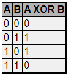

# 为什么计算机用二进制计数

人类的计数方式通常是“逢十进一”，称为十进制（Decimal），大概因为人有十个手指，所以十进制是最自然的计数方式，很多民族的语言文字中都有十个数字，而阿拉伯数字0~9是目前最广泛采用的。

计算机是用数字电路搭成的，数字电路中只有1和0两种状态，或者可以说计算机只有两个手指，所以对计算机来说二进制（Binary）是最自然的计数方式。根据“逢二进一”的原则，十进制的1、2、3、4分别对应二进制的1、10、11、100。二进制的一位数字称为一个位（Bit），三个bit能够表示的最大的二进制数是111，也就是十进制的7。不管用哪种计数方式，数的大小并没有变，十进制的1+1等于2，二进制的1+1等于10，二进制的10和十进制的2大小是相等的。事实上，计算机采用如下的逻辑电路计算两个bit的加法：

 图的上半部分（出自Wikipedia）的电路称为一位全加器（1-bit Full Adder），图的下半部分是一些逻辑电路符号的图例。我们首先解释这些图例，逻辑电路由门电路（Gate）和导线（Wire）组成，同一条导线上在某一时刻的电压值只能是高和低两种状态之一，分别用0和1表示。如果两条导线短接在一起则它们的电压值相同，在接点处画一个黑点，如果接点处没有画黑点则表示这两条线并没有短接在一起，只是在画图时无法避免交叉。导线的电压值进入门电路的输入端，经过逻辑运算后在门电路的输出端输出运算结果的电压值，任何复杂的加减乘除运算都可以分解成简单的逻辑运算。AND、OR和NOT运算在[第 3 节 “布尔代数”](https://akaedu.github.io/book/ch04s03.html#cond.bool)中讲过了，这三种逻辑运算分别用与门、或门和反相器（Inverter）实现。另外几种逻辑运算在这里补充一下。异或（XOR，eXclusive OR）运算的真值表如下：

用一句话概括就是：两个操作数相同则结果为0，两个操作数不同则结果为1。与非（NAND）和或非（NOR）运算就是在与、或运算的基础上取反：

如果把与门、或门和反相器组合来实现NAND和NOR运算，则电路过于复杂了，因此逻辑电路中通常有专用的与非门和或非门。现在我们看看上图中的AND、OR、XOR是怎么实现两个bit的加法的。A、B是两个加数， $$C_{in}$$ 是低位传上来的进位（Carry），相当于三个加数求和，三个加数都是0则结果为0，三个加数都是1则结果为11，即输出位S是1，产生的进位$$C_{out}$$也是1。下面根据加法的规则用真值表列出所有可能的情况：

请读者对照电路图验证一下真值表是否正确。如果把很多个一位全加器串接起来，就成了多位加法器，如下图所示（该图出自Wikipedia）：

图中的一位全加器用方框表示，上一级全加器的$$C_{out}$$连接到下一级全加器的 $$C_{in}$$ ，让进位像涟漪一样一级一级传开，所以叫做Ripple Carry Adder，这样就可以把两个4 bit二进制数 $$A_3A_2A_1A_0$$ 和 $$B_3B_2B_1B_0$$ 加起来了。在这里介绍Ripple Carry Adder只是为了让读者理解计算机是如何通过逻辑运算来做算术运算的，实际上这种加法器效率很低，只能加完了一位再加下一位，更实用、更复杂的加法器可以多个位一起计算，有兴趣的读者可参考[\[数字逻辑基础\]](../../appendix/reference.md#shu-zi-luo-ji-ji-chu-fundamentals-of-digital-logic-with-vhdl-design-stephen-brown-he-zvonko-vranesic-2)。  

